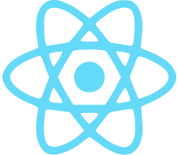

# Hello! 👋

&nbsp;&nbsp;

## Preferred Stack

<table >
	<tr align="center">
		<td></td>
		<td></td>
		<td></td>
		<td></td>
		<td></td>
		<td></td>
		<td></td>
		<td></td>
		<td></td>
		<td></td>
	</tr>
	<tr align="center">
		<td>C++</td>
		<td>Python</td>
		<td>TypeScript</td>
		<td>JavScript</td>
		<td>React</td>
		<td>Node.js</td>
		<td>MongoDB</td>
		<td>PostgreSQL</td>
		<td>Bash</td>
		<td>Git</git>
	</tr>
</table>

- 🔭 I’m currently working on Gesture Controlled Audio Softwares
- 🌱 I’m currently learning Machine Learning
- 👯 I’m looking to collaborate on Audio VST's
<!-- <table >
	<tr align="center">
		
	</tr>
	<tr align="center">
		
	</tr>
</table> -->

<!--
**Winphillips/Winphillips** is a ✨ _special_ ✨ repository because its `README.md` (this file) appears on your GitHub profile.

Here are some ideas to get you started:

- 🔭 I’m currently working on Gesture Controlled Audio Softwares
- 🌱 I’m currently learning Machine Learning
- 👯 I’m looking to collaborate on Audio VST's
- 🤔 I’m looking for help with ...
- 💬 Ask me about ...
- 📫 How to reach me: ...
- 😄 Pronouns: ...
- ⚡ Fun fact: ...
-->
